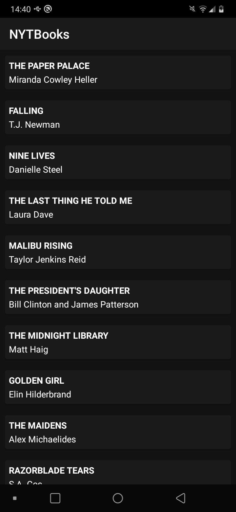
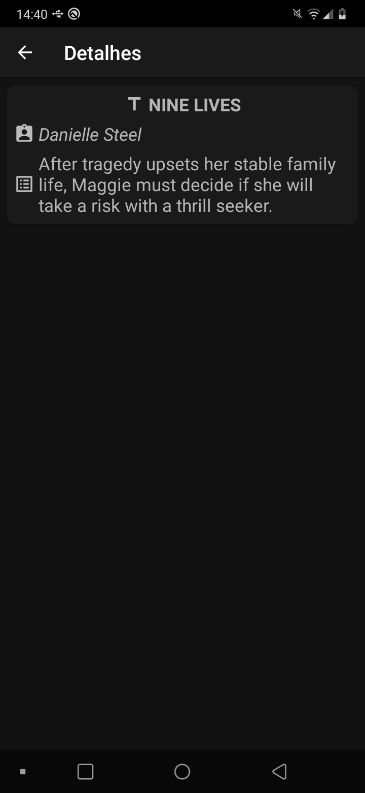

# Objetivo

O principal objetivo deste repositório é unicamente de estudos, ou seja, podem haver alguns erros. Pretendo atualizá-lo com um certo tempo. 
Todo o empenho do projeto é no código e em sua estrutura, então o design e layouts do app podem deixar a desejar.

Se você desejar, pode clonar e testar o aplicativo por si mesmo. Para fazer as consultas na API, é necessário obter uma chave de API. Siga os seguintes passos para obter sua API key:
- Acesse o [The New York Times Developer Network](https://developer.nytimes.com/accounts/login) e crie uma conta.
- [Crie um novo aplicativo](https://developer.nytimes.com/my-apps/new-app) e ative a opção de **Books API**.
- Copie sua **Key** e adicione-a na classe [Constants](https://github.com/jsericksk/NYTBooks/blob/master/app/src/main/java/com/kproject/nytbooks/utils/Constants.kt) do projeto.

## Screenshots

  
  

## Usos

O projeto utiliza a arquitetura [MVVM](https://developer.android.com/jetpack/guide), foco principal de estudo desse projeto, bem como os componentes [ViewModel](https://developer.android.com/topic/libraries/architecture/viewmodel) e [StateFlow](https://developer.android.com/kotlin/flow/stateflow-and-sharedflow) (anteriormente era utilizado o [LiveData](https://developer.android.com/topic/libraries/architecture/livedata)).
Para a request à API é utilizada a biblioteca [Retrofit](https://github.com/square/retrofit), e para o parser JSON, a [Gson](https://github.com/google/gson). 
Para uma melhor manipulação das views é utilizado [View Binding](https://developer.android.com/topic/libraries/view-binding).
